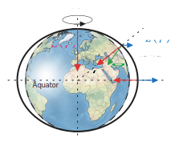

# Vorlesungsskript Gravimetrie

Dieses Repository enthält ein Skript zur Vorlesung "Gravimetrie" als Teil des Moduls "Gravimetrie und Magnetik" für Studierende des Bachelorstudienganges "Geophysik und Geoinformatik" am Institut für Geophysik und Geoinformatik der TU Bergakademie Freiberg.

