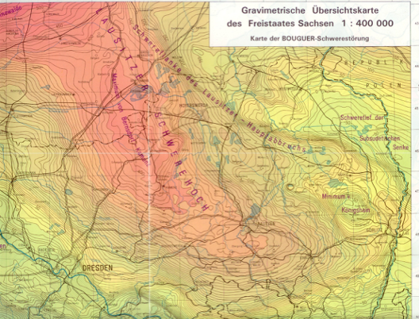
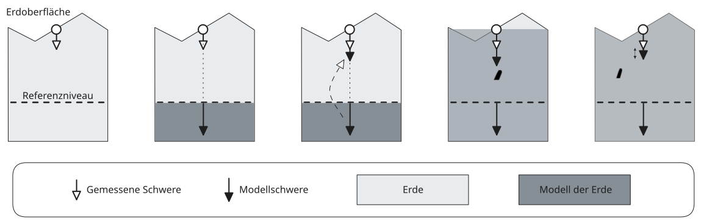
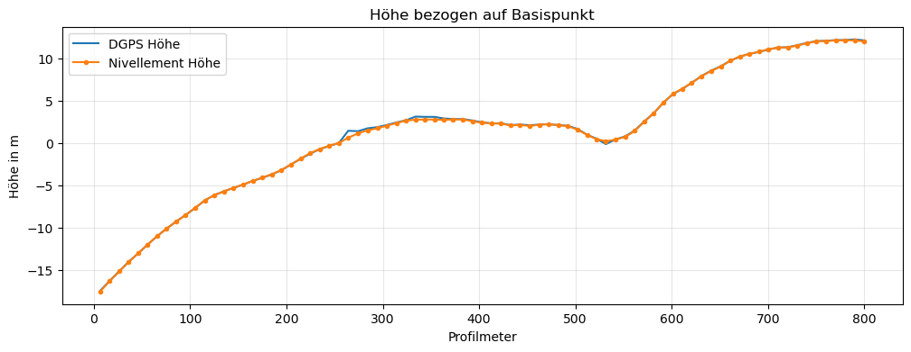
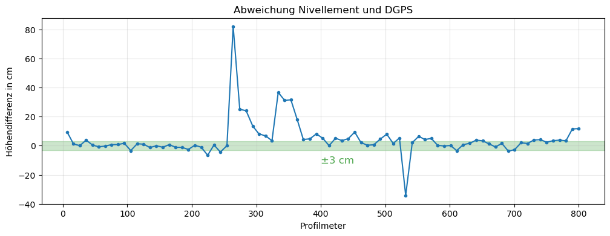
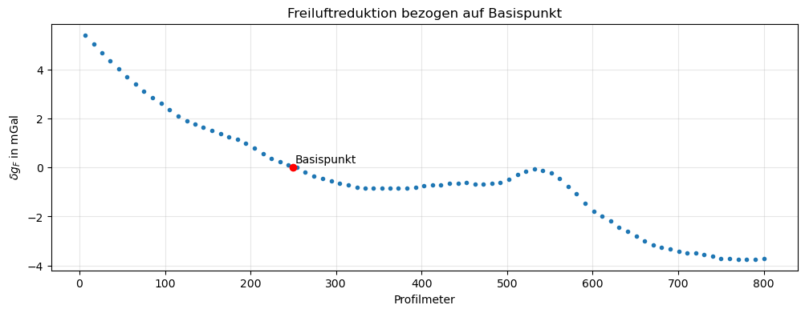
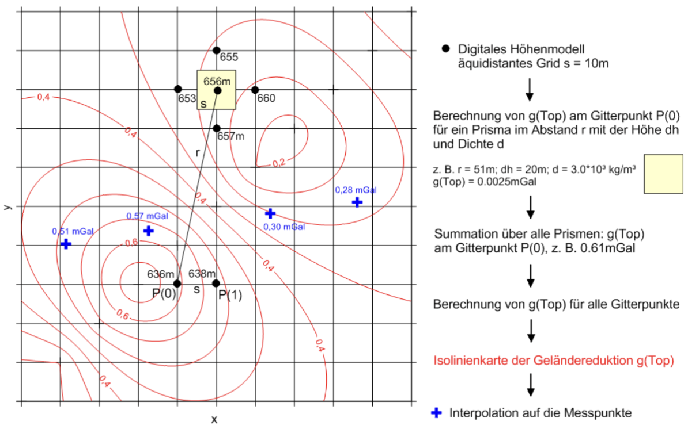
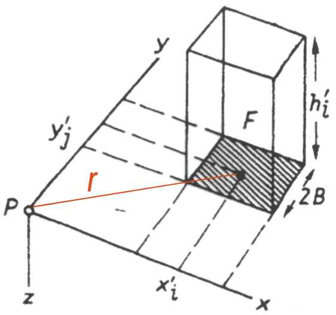
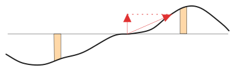

---
format:
  revealjs:
    output-file: reduktionen_slides.html
jupyter:
  kernel: python3
editor: source
---

::: {.callout-tip title="Lernziele"}
- Normalschwerereduktion
- Freiluftreduktion
- Bouguerreduktion
- Geländereduktion
:::

# Reduktionen

Ein an der Erdoberfläche beobachteter Schwerewert ist abhängig

- vom Ort des Beobachtungspunktes (geopgraphische Breite $\varphi$ und Höhe $h$) __$\to$ Reduktionen__
- von sichtbaren Masseinhomogenitäten (Morphologie) __$\to$ Reduktionen__
- von zeitlichen Änderungen der Schwerebeschleunigung (Gezeiten, Gerätedrift) __$\to$ Korrekturen__

__Schwereanomalien__ $\Delta g$ sind Abweichungen der gemessenen, korrigierten und reduzierten Schwerewerte von der Normalschwerebeschleunigung $\gamma_{0}$:

$$
\Delta g = g_{\text{korr,red}} - \gamma_{0}
$$

Schwereanomalien werden durch variable Dichteverteilung im Untergrund verursacht.

Wir unterscheiden

- __Kontinentale__ Schwereanomalien: Dichteinhomogenitäten im oberen Erdmantel
- __Regionale__ Schwereanomalien: Tiefere Stockwerke bis zur Grenze Erdkruste–oberer Erdmantel 
- __Lokale__ Schwereanomalien: Oberflächennahe geologische Einheiten und geotechnisch-bergauliche Situationen (Hohlräume) 

Beispiele für regionale Schwereanomalien:

- Alpenminimum: $-170$ mGal
- Magdeburger Schwerehoch: $+60$ mGal
- Lausitzer Schwerehoch: $+40$ mGal



## Bearbeitung primärer Messergebnisse

Beseitigung aller orts- und zeitabhängigen Einflüsse durch Reduktionen bzw. Korrekturen

```{mermaid}
graph TD
  A("Rohdaten $$\ g(x,y,z,t)$$") -- "Korrekturen $$\ \Delta g(t)$$" --> B("Gangkorrigierte relative Schwere $$\ g(x,y,z)$$")
  B -- "Reduktionen $$\ \delta g(x,y,z)$$ " --> C("Anomalie $$\ \Delta g(x,y,z)$$")
```



## Normalschwerereduktion
Beseitigung der Breitenabhängigkeit unter Beachtung des Erdellipsoid (WGS84)(globales Normalschwerefeld):

$$
\gamma_{0} = f(\varphi)
$$

Neben der Formel von Somigliana @eq-somigliana existieren weitere, über Reihenentwicklung abgeleitete Approximationen der Bauart

$$
\gamma(\varphi) = \gamma_{e}(
  1 + \alpha \sin^{2}(\varphi) + \beta \sin^{2}(2 \varphi)
)
$$ {#eq-gamma}

mit $\gamma_{e}$: Normalschwere am Äquator, $\alpha,\beta$: vom verwendeten Erdellipsoid abhängige Parameter.

Vor dem Hintergrund der heute erreichbaren Messgenauigkeiten ist die Formel vn Somigliana @eq-somigliana zu bevorzugen.

Für das __Geodetic Reference System GRS80__ sind
$$
\begin{align}
\gamma_{e} & = 9.780327\ \mathrm{\frac{m}{s^{2}}} \\
\alpha & = 5.3024\times 10^{-3} \\
\beta & = 5.8\times 10^{-6}
\end{align}
$$

In mittleren Breiten beträgt die Normalschwerereduktion
$$
\delta g_{H} = 0.8\ \text{mGal/km}
$$ {#eq-normalschwere}

Die Normalschwere nimmt bei $\varphi = 50\textdegree$ auf einem Profil nach Norden um 0.8 mGal/km zu.
Ein Lagefehler des Messpunktes von 10 m in N-S-Richtung verursacht damit einen Reduktionsfehler von 0.08 $\mu$m$s^{-2} =$ 0.008 mGal.

Die so geforderten Genauigkeiten der Lagebestimmung werden von (D)GPS-Instrumenten ohne weiteres erreicht.

::: {.callout-note title="Berechnung"}
Wir berechnen den Reduktionsfehler für einen Lagefehler von 10 m. Dazu benutzen wir Gl. @eq-gamma mit den oben angegeben Werten für die Konstanten $\gamma_{e}$, $\alpha$ und $\beta$.

Gesucht wird nach dem Fehlerfortpflanzungsgesetz
$$
\Delta\gamma = \Bigg| \frac{ \partial \gamma }{ \partial \varphi } \Bigg| \Delta \varphi
$$


Zuerst berechnen wir die Ableitung von $\gamma$ nach dem Winkel $\varphi$ und setzen die Konstanten (mit $\gamma_{e}$ in mGal) ein.
```{python}
import numpy as np
import sympy as sp
import matplotlib.pyplot as plt
from IPython.display import display, Latex, HTML, Math

showlatex = lambda s: display(HTML(f"$${s}$$"))

gamma_e, phi, alpha, beta = sp.symbols("gamma_e, phi, alpha, beta")
gamma = gamma_e * (1 + alpha * sp.sin(phi)**2 + beta * sp.sin(2 * phi)**2)
dgammadphi = sp.diff(gamma, phi).simplify()
showlatex(r" \frac{ \partial \gamma }{ \partial \varphi } = " + sp.latex(dgammadphi.simplify()))
ex = dgammadphi.subs(gamma_e, 9.780327e5).subs(alpha, 5.3024e-3).subs(beta, 5.8e-6)
showlatex(r" \frac{ \partial \gamma }{ \partial \varphi } = " + sp.latex(ex))

```


Welchem Öffnungswinkel $\Delta\varphi$ entspricht eine N-S-verlaufende Strecke von $H=$ 10 m?

$$
\Delta\varphi = 2 \arcsin \frac{H}{2 R_{E}}
$$

```{python}
R_E = 6370e3
H = 10
dphi = 2 * np.arcsin(H/R_E/2)
display(HTML(rf"\(\Delta \varphi \) = {dphi * 180 / np.pi * 60:.3e} Bogenminuten"))
```

In mittleren Breiten mit $\varphi \approx 50 \textdegree$ erhalten wir für $\Delta\gamma$

```{python}
expr = ex.subs(phi, 50.0 * sp.pi / 180.0).evalf() * dphi
display(HTML(rf"\( \Delta \gamma \) = {expr:.3e} mGal"))
```

Ein Lagefehler von 10 m verursacht also einen Reduktionsfehler von 0.008 mGal.

Der Verlauf der breitenabhängigen __Änderung__ der Normalschwere $\gamma$ wird aus der Ableitung von $\gamma$ nach $\varphi$ entlang eines Meridians in Polarkoordinaten ermittelt, wonach

$$
\frac{1}{R_{E}}\frac{ \partial \gamma }{ \partial \varphi } \approx \frac{2 \gamma_{e}\alpha \cos\varphi \sin\varphi}{R_{E}}.
$$


```{python}
phis = np.arange(start=0.0, stop=90.1, step=1.0)

dgdf = np.array([(ex / 6370e3).subs(phi, np.deg2rad(v)) for v in phis])
fig, ax = plt.subplots(figsize=(6,3))
ax.plot(phis, 1e3 * dgdf)
ax.set_xlabel("Breite in Grad")
ax.set_ylabel("Schwereänderung in mGal/km")
ax.set_xlim((0,90))
ax.set_ylim((0,1))
ax.grid(alpha=0.3)
```

Andererseits erkennen wir an der Abbildung, dass sich bei Bewegung des Messpunktes um 1 km nach Norden die Normalschwere in mittleren Breiten um 0.8 mGal erhöht.

Daraus resultiert auch die Näherungsformel @eq-normalschwere für die Normalschwerereduktion in mittleren Breiten.
:::

## Freiluftreduktion

Die Normalschwerereduktion nach Gl. @eq-normalschwere wendet man an, um die breitenabhängige Änderung der Schwere auf der Oberfläche des Erdellipsoids zu kompensieren.
Die Höhe des Messpunktes über dem Referenzniveau (Erdellipsoid) wird davon nicht erfasst.

Diese Wirkung der Höhenabhängigkeit wird durch die Freiluftreduktion korrigiert. Wir erreichen durch die Beseitigung des Einflusses der Geländehöhe des Messpunktes eine Darstellung der gemessenen Daten auf einem gemeinsamen Bezugsniveau.

Wir unterscheiden folgende Bezugsniveaus:

- Meeresniveau bei Regionalmessungen
- Am tiefsten gelegener Messpunkt bei Spezial- und Mikromessungen


Der Freiluftgradient beträgt
$$
\frac{ \partial \gamma_{0} }{ \partial h } = -0.3086\ \text{mGal}/\text{m}
$$ 
Mit zunehmender Höhe über dem Referenzellipsoid nimmt der Wert der Normalschwere in mittleren Breiten um etwa $0.3086$ mGal pro Meter ab.

Die __Freiluftreduktion__ beträgt
$$
\delta g_{F} = -0.3086 \, h \text{ mGal},
$$ {#eq-freiluftreduktion}

wenn die Höhe über dem Referenzniveau $h$ in Metern angegeben wird.

::: {.callout-note title="Berechnung"} 
Unter der Annahme einer kugelförmigen, homogenen Erde ergibt sich die Höhenabhängigkeit der Schwere aus
$$
g(h) = g_{0} \left( 
  \frac{R}{R + h}
\right)^{2}
$$

```{python}
RE, h, g0 = sp.symbols("R_E, h, g_0")
dgf = g0 - sp.series(g0 * (RE / (RE + h))**2, h, 0, 2).removeO()
showlatex(r"\delta g_{F} = " + sp.latex(dgf))
```
 
Die Schwere nimmt außerhalb der Erde um
```{python}
-dgf.subs(RE, 6371e3).subs(g0, 9.81e5).subs(h, 1).evalf()
```
mGal pro Meter Höhe ab.
Dieser Wert ist nur eine Näherung, der von dem in der Praxis als Standard verwenden Zahlenwert von $-0.3086$ etwas abweicht. 

Genauere Zahlen erhält man, wenn das Modell der Erdbeschleunigung über ein Erdellipsoid definiert wird. So kann bspw. berechnet werden, dass der Wert der Freiluftreduktion selbst höhenabhängig ist. In diesem Zusammenhang sind Kugelfunktionen bedeutsam.
:::

Welche Genauigkeitsforderung ist mit der Freiluftreduktion verbunden?

Wir nutzen das Fehlerfortpflanzungsgesetz:

$$
\Delta (\delta g_{F}) = \Bigg|\frac{ \partial \delta g_{F} }{ \partial h }\Bigg| \, \Delta h
$$

Bei einer geforderten Genauigkeit von $\Delta(\delta g_{F}) \le$ 0.01 mGal erhalten wir
$$
\Delta h = \frac{1}{0.3086\ \text{mGal/m}} \, 0.01 \text{ mGal} \le 0.03\ \text{m}.
$$

Diese Forderung wird in der Regel mit einem Nivellement erreicht.
Problematisch ist der Einsatz von DGPS. Dort führen Geländebedingungen (Vegetation, Topographie) zu Fehlern, die nicht vernachlässigbar sind.





Die Abbildung zeigt den Vergleich der Höhenmessungen mittels Nivellement und DGPS auf identischen Punkten eines Gravimetrieprofils im Zellwald.
Das im unteren Bild markierte Intervall von $\pm\ 3$ cm zeigt, dass nur ein Teil der DGPS-Höhen den Genauigkeitsanforderungen von $\Delta (\delta g_{F}) \le$ 0.01 mGal genügt.

Für das oben dargestellte Höhenprofil ergibt sich nach Gl. @eq-freiluftreduktion folgende Freiluftreduktion:



Wir haben gesehen, dass die Freiluftreduktion pro Meter Höhenänderung in mittleren Breiten einen etwa 400 mal größeren Effekt auf den Messwert hat als eine gleiche Änderung in der Breite (genauer: im Hochwert).

```{python}
print(f"Betragsverhältnis: {0.3086 / 0.8e-3:.3f}")
```

Zusammenfassung: Die Freiluftanomalie ergibt sich nach Anwendung der Freiluftreduktion
$$
\Delta g_{F} = g_{0} - \gamma_{0} - \delta g_{F}
$$
Der erste Term ist die an Messpunkt beobachtete, gezeiten- und instrumentendriftkorrigierte relative Schwere, der zweite Term ist die theoretische Schwere auf der Oberfläche des Referenzellipsoids.
Der dritte Term korrigiert die Schwere auf eine Äquipotentialfläche oder Bezugsfläche.

Die Reduktion ist nur dann exakt, wenn keine Massen zwischen Messpunkt und Bezugsniveau liegen.
Diese Annahme trifft in der Praxis nicht zu, daher sind weitere Reduktionen zur Korrektur der zwischen Mess- und Bezugsniveau vorhandenen Massen notwendig.

## Bouguerreduktion

Die Normalfeld- und Freiluftreduktionen berücksichtigen lediglich die Abhängigkeit der modellhaften Schwere eines Erdellipsoids von Breite und Höhe des Messpunktes.

Die Bouguerreduktion berechnet die Schwere einer unter dem Messpunkt befindlichen, allseitig ausgedehnten Platte der Mächtigkeit $H$ (_Reduktionshöhe_) und _Reduktionsdichte_ $\rho$.

Wir unterscheiden grundsätzlich zwischen

- einfacher Bouguerreduktion und
- vollständige Bouguerreduktion einschließlich Geländereduktion.

Die einfache Bouguerreduktion ergibt sich aus
$$
\delta g_{B} = 2 \pi f \rho \, h
$$

Beispiel:

Mächtigkeit 100 m, Dichte 2700 kg/m$^3$.

```{python}
dgb = 2 * np.pi * 6.674e-11 * 2700 * 100 * 1e5
display(HTML(rf"\( \delta g_B = \) {dgb:.3f} mGal"))
```

$$
\Delta g_{B} = g_{0} -\gamma_{0} - \delta g_{F} -\delta g_{B}
$$

Näherung für Reduktionsdichte $\rho=2670$ kg/m$^{3}$, $h$ in Meter:
```{python}
display(HTML(rf"\( \delta g_B \approx \) {2 * np.pi * 6.674e-11 * 2670 * 1e5:.4f} \( \cdot h \) in mGal"))
```

## Geländereduktion

Bei starker Topographie ist eine weitere Reduktion erforderlich.
Die _Geländereduktion_ hat zum Ziel, den Einfluss von Geländeunebenheiten zu beseitigen, welcher von der Bouguerreduktion nicht erfasst wird.



Grundlage:

Näherungsformel für vertikales Prisma mit quadratischer Grundfläche und Kantenlänge $2B$

::: {.columns}
::: {.column width="72%"}
$$
\delta g_{Top}(P) = 2 f \rho B^{2} \frac{h_{i}^{2}}{r_{i}^{3}} \left( 
  1 + \frac{3 B^{2}}{2 r_{i}^{2}}
\right)
$$
wobei $h_{i}^{2} \ll r_{i}^{2}$ gelten muss. Wenn $r \gg B$ kann der Klammerterm vernachlässigt werden.
:::
::: {.column width="25%"}

:::
:::



$$
\Delta g_{B} = g_{0} -\gamma_{0} - \delta g_{F} -\delta g_{B} + \delta g_{T}
$$